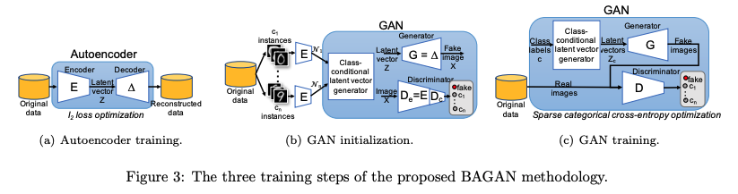
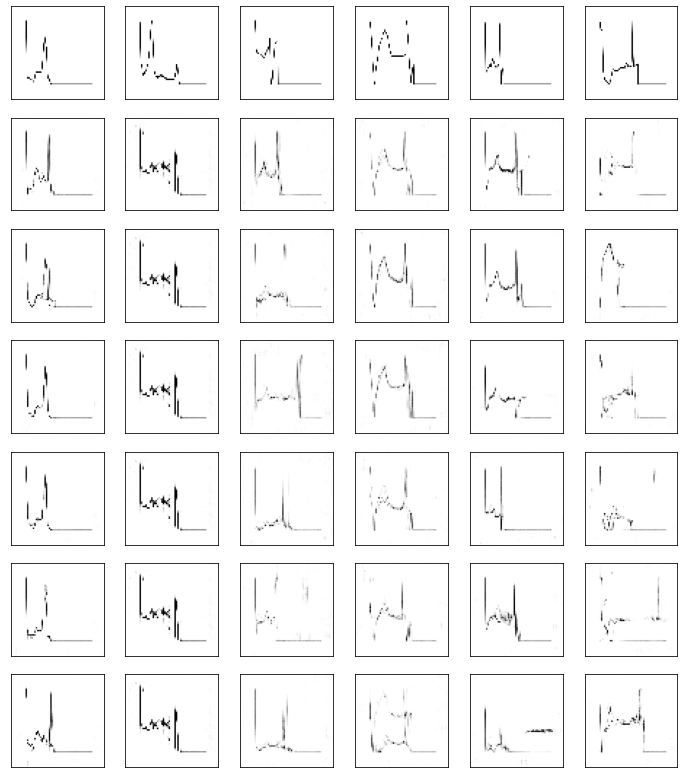
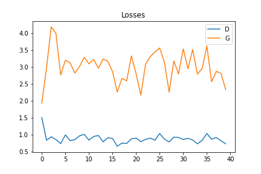

# Introduction
According to the article "BAGAN: Data Augmentation with Balancing GAN" by Mariani et al (2018), BAGAN was developed to generate minority-class images.

> https://arxiv.org/abs/1803.09655

The proposed BAGAN methodology consists of three training steps: 

1. Pre-training of the autoencoder: The encoder module of an autoencoder is trained to learn an accurate class-conditioning in the latent space.

2. Adversarial training of the generator and discriminator: The generator is initialized with the encoder module of the pre-trained autoencoder, and then adversarially trained with a discriminator to generate high-quality images. During this process, we apply class conditioning in the latent space to drive the generation process towards a target class.

3. Fine-tuning of deep-learning classifiers: The augmented dataset generated by BAGAN is used to fine-tune deep-learning classifiers, resulting in higher accuracy compared to other generative adversarial networks when aiming at the generation of high-quality images starting with an imbalanced training set.

# Sample

# Losses

# Discussion

**Common problems of GANs**

1.   Vanishing Gradients
> Vanishing gradients usually caused during back propagation. It is happen when the gradients become very small by each iteration of training after partial derivatives. Then cause slow, and eventually stopped the weights update.

2.   Mode Collapse
> Mode collapse is a type of GAN failure where each iteration of the generator over-optimizes for a specific discriminator, leading to the discriminator being unable to learn and escape from this trap. Consequently, the generator ends up producing a limited range of output types, causing a rotation effect.

> With for time and resources, I hope this model would perform better results.
